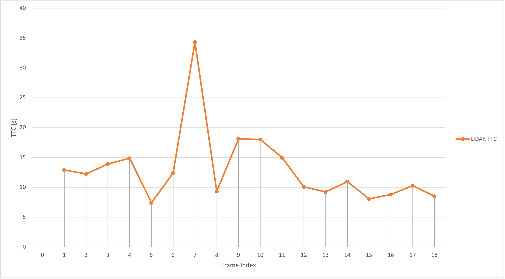
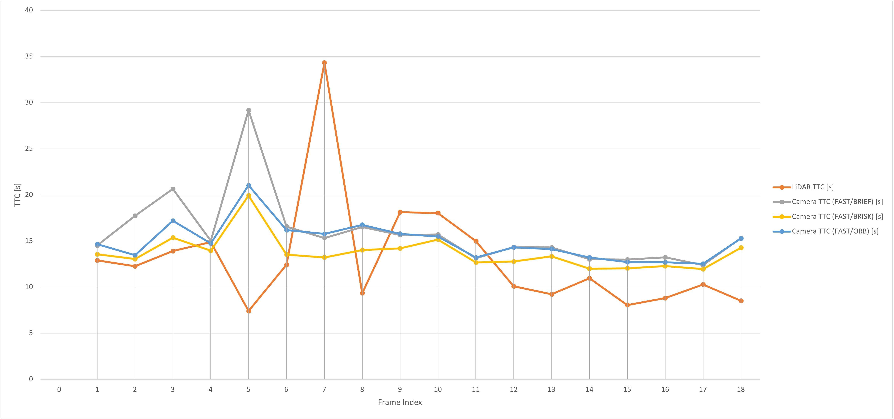

# Write up

## FP.1 Match 3D Objects

>Implement the method "matchBoundingBoxes", which takes as input both the previous and the current data frames and provides as output the ids of the matched regions of interest (i.e. the boxID property). Matches must be the ones with the highest number of keypoint correspondences.

```cpp
void matchBoundingBoxes(std::vector<cv::DMatch> &matches, std::map<int, int> &bbBestMatches, DataFrame &prevFrame, DataFrame &currFrame)
{
    // BoxID_prev, BoxID_curr, count of matches for same bounding boxes
    std::map<std::pair<int, int>, int> matchCandiates;

    std::multimap<int, int> boxIDprevFrame;
    std::multimap<int, int> boxIDCurrFrame;

    std::vector<BoundingBox> prevBoundingBoxes, currBoundingBoxes;

    prevBoundingBoxes = prevFrame.boundingBoxes;
    currBoundingBoxes = currFrame.boundingBoxes;

    // Loop over all keyPoint Matches
    for(auto itrKeyPointMatches = matches.begin(); itrKeyPointMatches != matches.end(); ++itrKeyPointMatches)
    {
        int prevFrame_KeyP_Idx = itrKeyPointMatches->queryIdx;
        int currFrame_KeyP_Idx = itrKeyPointMatches->trainIdx;

        

        // Loop over BoundingBoxes in prevFrame and check if KeyPoint is contained
        for(auto itrPrevBBoxes = prevBoundingBoxes.begin(); itrPrevBBoxes != prevBoundingBoxes.end(); ++itrPrevBBoxes)
        {
            // Loop over BoundingBoxes in currFrame and check if KeyPoint is contained
            for(auto itrCurrBBoxes = currBoundingBoxes.begin(); itrCurrBBoxes != currBoundingBoxes.end(); ++itrCurrBBoxes)
            {
                // Are the matched KeyPoints part of the ROI in their respective frames?
                if( itrPrevBBoxes->roi.contains( prevFrame.keypoints.at(prevFrame_KeyP_Idx).pt) && 
                    itrCurrBBoxes->roi.contains( currFrame.keypoints.at(currFrame_KeyP_Idx).pt) )
                {

                    // Check if key exists
                    std::map<std::pair<int, int>, int>::iterator it_matchCandiates = matchCandiates.find(std::pair<int,int>(itrPrevBBoxes->boxID, itrCurrBBoxes->boxID));

                    if (it_matchCandiates != matchCandiates.end() )
                    {
                        // Increment counter
                        it_matchCandiates->second = it_matchCandiates->second + 1;
                    }
                    else
                    {
                        // Add BoxID Pair and set counter to 1
                        matchCandiates.insert(std::pair<std::pair<int, int>, int>(std::pair<int, int>(itrPrevBBoxes->boxID, itrCurrBBoxes->boxID), int(1)) );
                    }
                }
            
            }
            
        }

        
    }

    // Loop over BoundingBoxes in prevFrame, to find the BoundingBox Match Candidate with the hightest count of matching keypoints
    for(auto itrPrevBBoxes = prevBoundingBoxes.begin(); itrPrevBBoxes != prevBoundingBoxes.end(); ++itrPrevBBoxes)
    {   
        std::pair<int,int> bestMatch = make_pair(99999,99999);
        int bestMatch_count = 0;

        for (const auto &map_entry: matchCandiates)
        {
            auto key_pair = map_entry.first;
            if( key_pair.first == itrPrevBBoxes->boxID && map_entry.second > bestMatch_count)
            {
                bestMatch = key_pair;
                bestMatch_count = map_entry.second;
            }

        }

        if( bestMatch_count > 0 )
        {
            bbBestMatches.insert(bestMatch);
        }
        
    }

}
```

---

## FP.2 Compute Lidar-based TTC

> Compute the time-to-collision in second for all matched 3D objects using only Lidar measurements from the matched bounding boxes between current and previous frame.

```cpp
void computeTTCLidar(std::vector<LidarPoint> &lidarPointsPrev,
                     std::vector<LidarPoint> &lidarPointsCurr, double frameRate, double &TTC)
{
    // Sort LiDAR Point Vectors by distance in X direction
    sort(lidarPointsCurr.begin(), lidarPointsCurr.end(), compareByDistanceX);
    sort(lidarPointsPrev.begin(), lidarPointsPrev.end(), compareByDistanceX);

    double medianXPrev = getDistanceXMedian(lidarPointsPrev);
    double medianXCurr = getDistanceXMedian(lidarPointsCurr);

    double minXPrev = 1e9, minXCurr = 1e9;
    
    double minXValuePrev = lidarPointsPrev.at(0).x;
    double minXValueCurr = lidarPointsCurr.at(0).x;

    double Q1XPrev = getDistanceXQ1(lidarPointsPrev);
    double Q1XCurr = getDistanceXQ1(lidarPointsCurr);

    double Q3XPrev = getDistanceXQ3(lidarPointsPrev);
    double Q3XCurr = getDistanceXQ3(lidarPointsCurr);

    double IQRXPrev = Q3XPrev - Q1XPrev;
    double IQRXCurr = Q3XCurr - Q1XCurr;

    double outlierXTresholdPrev = Q1XPrev - (1.5 * IQRXPrev);
    double outlierXTresholdCurr = Q1XCurr - (1.5 * IQRXCurr);

    cout << "Previous Frame -> Median X = " << medianXPrev << ";  outlier Threshold = " << outlierXTresholdPrev << ";  Min X = " << minXValuePrev << endl;
    cout << "Current Frame -> Median X = " << medianXCurr << ";  outlier Threshold = " << outlierXTresholdCurr << ";  Min X = " << minXValueCurr << endl;

    // find closest Lidar point (x-direction)
    for (auto it = lidarPointsPrev.begin(); it != lidarPointsPrev.end(); ++it)
    {
        // only consider points above the outlier threshold (Q1 - 1.5 * IQR)
        if (it->x >= outlierXTresholdPrev)
        {
            minXPrev = minXPrev > it->x ? it->x : minXPrev;
        }
        
    }

    for (auto it = lidarPointsCurr.begin(); it != lidarPointsCurr.end(); ++it)
    {
        // only consider points above the outlier threshold (Q1 - 1.5 * IQR)
        if (it->x >= outlierXTresholdCurr)
        {
            minXCurr = minXCurr > it->x ? it->x : minXCurr;
        }
    }

    // compute TTC from both measurements
    TTC = minXCurr * (1 / frameRate) / (minXPrev - minXCurr);

}
```

---

## FP.3 Associate Keypoint Correspondences with Bounding Boxes

> Prepare the TTC computation based on camera measurements by associating keypoint correspondences to the bounding boxes which enclose them. All matches which satisfy this condition must be added to a vector in the respective bounding box.

```cpp
// associate a given bounding box with the keypoints it contains
void clusterKptMatchesWithROI(BoundingBox &boundingBox, std::vector<cv::KeyPoint> &kptsPrev, std::vector<cv::KeyPoint> &kptsCurr, std::vector<cv::DMatch> &kptMatches)
{
    // Temp results
    std::vector<cv::DMatch> bb_kptMatches;
    std::vector<double> match_distance;

    // Loop over all keyPoint Matches
    for(auto itrKeyPointMatches = kptMatches.begin(); itrKeyPointMatches != kptMatches.end(); ++itrKeyPointMatches)
    {
        cv::KeyPoint prevKpt = kptsPrev[itrKeyPointMatches->queryIdx];
        cv::KeyPoint currKpt = kptsCurr[itrKeyPointMatches->trainIdx];
        
        // Check if Keypoint within BoundingBox
        if (boundingBox.roi.contains(currKpt.pt))
        {
            // Add to vector of matches with BoundingBox
            bb_kptMatches.push_back(*itrKeyPointMatches);

            // Calc euclidean distance to prev Keypoint and add distance to vector match_distance
            double kpts_distance = cv::norm(currKpt.pt - prevKpt.pt);
            match_distance.push_back(kpts_distance);
        }

    }

    // robust mean (median) of distanes
    double median_distance = calculateMedian(match_distance);

    // Filter all matches, where distance is too far off the median 
    for(size_t i = 0; i < bb_kptMatches.size(); ++i)
    {
        const cv::DMatch& bb_kptMatch = bb_kptMatches[i];
        const double match_dist = match_distance[i];

        if ( match_dist < median_distance * 1.3 )
        {
            boundingBox.kptMatches.push_back(bb_kptMatch);
        }
    }
}
```

---

## FP.4 Compute Camera-based TTC

> Compute the time-to-collision in second for all matched 3D objects using only keypoint correspondences from the matched bounding boxes between current and previous frame.

```cpp
// Compute time-to-collision (TTC) based on keypoint correspondences in successive images
void computeTTCCamera(std::vector<cv::KeyPoint> &kptsPrev, std::vector<cv::KeyPoint> &kptsCurr, 
                      std::vector<cv::DMatch> kptMatches, double frameRate, double &TTC, cv::Mat *visImg)
{
    // compute distance ratios between all matched keypoints
    vector<double> distRatios; // stores the distance ratios for all keypoints between curr. and prev. frame
    for (auto it1 = kptMatches.begin(); it1 != kptMatches.end() - 1; ++it1)
    { // outer keypoint loop

        // get current keypoint and its matched partner in the prev. frame
        cv::KeyPoint kpOuterCurr = kptsCurr.at(it1->trainIdx);
        cv::KeyPoint kpOuterPrev = kptsPrev.at(it1->queryIdx);

        for (auto it2 = kptMatches.begin() + 1; it2 != kptMatches.end(); ++it2)
        { // inner keypoint loop

            double minDist = 100.0; // min. required distance

            // get next keypoint and its matched partner in the prev. frame
            cv::KeyPoint kpInnerCurr = kptsCurr.at(it2->trainIdx);
            cv::KeyPoint kpInnerPrev = kptsPrev.at(it2->queryIdx);

            // compute distances and distance ratios
            double distCurr = cv::norm(kpOuterCurr.pt - kpInnerCurr.pt);
            double distPrev = cv::norm(kpOuterPrev.pt - kpInnerPrev.pt);

            if (distPrev > std::numeric_limits<double>::epsilon() && distCurr >= minDist)
            { // avoid division by zero

                double distRatio = distCurr / distPrev;
                distRatios.push_back(distRatio);
            }
        } // eof inner loop over all matched kpts
    }     // eof outer loop over all matched kpts

    // only continue if list of distance ratios is not empty
    if (distRatios.size() == 0)
    {
        TTC = NAN;
        return;
    }

    // compute camera-based TTC from distance ratios

    double median_distanceRatio = calculateMedian(distRatios);

    double dT = 1 / frameRate;
    TTC = -dT / (1 - median_distanceRatio);

}

```

---

## FP.5 : Performance Evaluation 1

> This exercise is about conducting tests with the final project code, especially with regard to the Lidar part. Look for several examples where you have the impression that the Lidar-based TTC estimate is way off. Once you have found those, describe your observations and provide a sound argumentation why you think this happened.
>
> The task is complete once several examples (2-3) have been identified and described in detail. The assertion that the TTC is off should be based on manually estimating the distance to the rear of the preceding vehicle from a top view perspective of the Lidar points.


Below's plot shows the TTC over all frames. Frame 5, 7 and 8 seem to be good examples 



Possible reasons for the outliners might be due to the following LiDAR Detection Challenges:

**Potential for Measurement Variations:** LiDAR detection can be influenced by the sensor's range precision and reflections from different vehicle parts. This may cause slight variations in the detected distance between frames.

**Sensitivity in Slow Traffic:** In slow-moving traffic scenarios, where the relative velocity between vehicles is small, even minor distance errors from LiDAR can have a more significant impact on calculating the relativ speed (delta velocity).

---

## FP.6

> This last exercise is about running the different detector / descriptor combinations and looking at the differences in TTC estimation. Find out which methods perform best and also include several examples where camera-based TTC estimation is way off. As with Lidar, describe your observations again and also look into potential reasons. This is the last task in the final project.
>
>The task is complete once all detector / descriptor combinations implemented in previous chapters have been compared with regard to the TTC estimate on a frame-by-frame basis. To facilitate the comparison, a spreadsheet and graph should be used to represent the different TTCs.

For this task I selected the Top 3 detector / descriptor combinations evaluated in project SFND_2D_Feature_Tracking.

* FAST - BRIEF
* FAST - BRISK
* FAST - ORB



| Image Frame | LiDAR TTC [s] | Camera TTC (FAST/BRIEF) [s] | Camera TTC (FAST/BRISK) [s] | Camera TTC (FAST/ORB) [s] |
|-------------|---------------|-----------------------------|-----------------------------|---------------------------|
| 0           |               |                             |                             |                           |
| 1           | 12.9          | 14.51                       | 13.56                       | 14.66                     |
| 2           | 12.26         | 17.73                       | 13.05                       | 13.47                     |
| 3           | 13.91         | 20.64                       | 15.37                       | 17.2                      |
| 4           | 14.88         | 15.03                       | 13.95                       | 14.74                     |
| 5           | 7.41          | 29.19                       | 19.93                       | 21.04                     |
| 6           | 12.42         | 16.57                       | 13.53                       | 16.18                     |
| 7           | 34.34         | 15.33                       | 13.22                       | 15.77                     |
| 8           | 9.34          | 16.52                       | 14.01                       | 16.75                     |
| 9           | 18.13         | 15.66                       | 14.2                        | 15.78                     |
| 10          | 18.03         | 15.71                       | 15.16                       | 15.49                     |
| 11          | 14.98         | 13.14                       | 12.67                       | 13.21                     |
| 12          | 10.09         | 14.34                       | 12.78                       | 14.31                     |
| 13          | 9.22          | 14.3                        | 13.34                       | 14.13                     |
| 14          | 10.96         | 13.03                       | 12                          | 13.21                     |
| 15          | 8.06          | 12.98                       | 12.04                       | 12.72                     |
| 16          | 8.81          | 13.23                       | 12.28                       | 12.7                      |
| 17          | 10.29         | 12.4                        | 11.95                       | 12.53                     |
| 18          | 8.52          | 15.32                       | 14.27                       | 15.27                     |